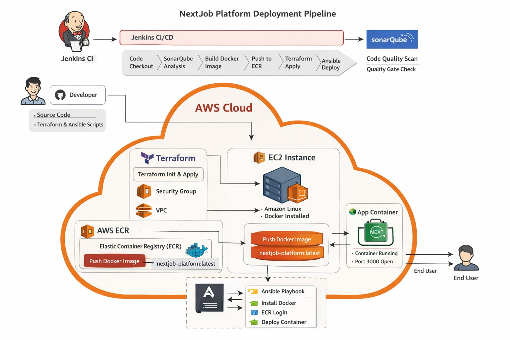

🚀 NextJob Platform — End-to-End DevOps Project
📌 Overview

NextJob Platform is a complete DevOps portfolio project that demonstrates a real-world, end-to-end CI/CD pipeline for deploying a containerized Next.js application on AWS.

This project showcases how modern DevOps tools work together to automate:

Application build and testing
Code quality analysis
Infrastructure provisioning
Containerization
Deployment to cloud environments

🏗️ Architecture

The system follows a modern DevOps workflow:

Developer pushes code to GitHub
Jenkins pipeline is triggered
Application is built and analyzed (SonarQube)
Docker image is created
Image is pushed to AWS ECR
Terraform provisions AWS infrastructure
Ansible configures EC2 and deploys the application
The app runs inside a Docker container on EC2

⚙️ Tech Stack
Category	Tools Used
CI/CD	Jenkins
Code Quality	SonarQube
Infrastructure	Terraform
Configuration	Ansible
Containerization	Docker
Cloud Provider	AWS
Registry	AWS ECR
Compute	AWS EC2
App Framework	Next.js

📂 Project Structure
nextjob-platform/
│
├── app/                # Next.js application
│   ├── Dockerfile
│   └── source code
│
├── terraform/          # Infrastructure as Code
│   ├── main.tf
│   ├── variables.tf
│   └── outputs.tf
│
├── ansible/            # Deployment automation
│   ├── playbook.yml
│   ├── inventory.ini
│   └── ansible.cfg
│
├── jenkins/
│   └── Jenkinsfile     # CI/CD pipeline
│
└── README.md

🔄 CI/CD Pipeline Flow
1. Checkout
Jenkins pulls the source code from GitHub
2. Build Application
Install dependencies
Build the Next.js application
3. SonarQube Analysis
Perform static code analysis
Enforce quality gate
4. Docker Build
Build a production-ready Docker image
5. Push to ECR
Authenticate with AWS
Push the image to Amazon ECR
6. Terraform Apply
Provision EC2 instance
Create Security Group
Attach IAM Role for secure ECR access
7. Ansible Deployment
Install Docker and AWS CLI
Authenticate to ECR using IAM Role
Pull Docker image
Run container

☁️ AWS Infrastructure

Terraform provisions:

EC2 Instance
Amazon Linux
Runs Docker container
Security Group
Port 22 → SSH access
Port 3000 → Application access
IAM Role
Grants EC2 access to ECR
Eliminates need for hardcoded credentials
🐳 Docker
Multi-stage Docker build
Optimized production image
Runs application on port 3000
🔐 Security Best Practices
No AWS credentials stored on EC2
IAM Role used for secure access to ECR
Jenkins uses credentials securely
Infrastructure managed as code

▶️ How to Run
1. Clone Repository
git clone https://github.com/AhmadAlabrash/terraform-ansible-infrastructure.git
cd terraform-ansible-infrastructure
2. Configure Jenkins
Add AWS credentials (aws-creds)
Configure SonarQube server
Install required plugins:
Pipeline
AWS Credentials
SonarQube Scanner
Docker
3. Run Pipeline
Trigger Jenkins job
Pipeline will automatically:
Build → Scan → Package → Deploy
🌍 Access Application

👨‍💻 Author

AhmadAlabrash

GitHub: https://github.com/AhmadAlabrash
